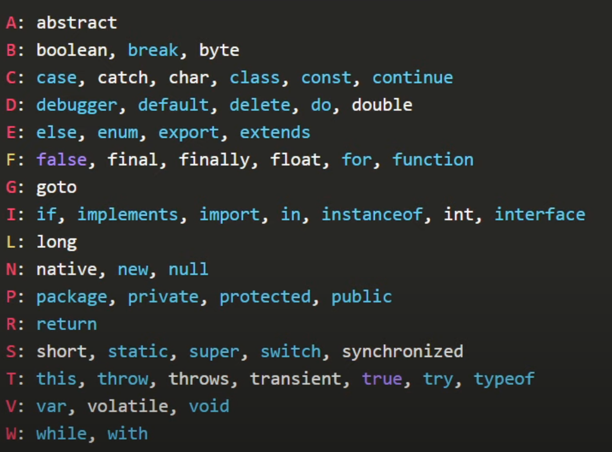

# Clase 2 - Caracteristicas y gramática.

## JavaScript ISOMORFISMO

Hoy JavaScript, es el único lenguaje de programación que es capaz de ejecutarse en las 3 capas de una aplicación.

1. Frontend (JavaScript).
2. Backend (Node.js).
3. Persistencia de datos (MongoDB, CouchDB, FireBase).

## Con JavaScript puedes hacer

- Diseño y desarrollo web.
- Hacer videojuegos.
- Electronica.
- Experiencia 3D.
- Machile Learning.
- Etc.

JavaScript es muy buena idea para aprender a programar, JavaScript != Java.

## Características

- Lenguaje de alto nivel.
- Interpretado.
- Dinámico.
- Débilmente Tipado.
- Multi paradigma.
- Sensible a MAYÚSCULAS y minúsculas (casesentive).
- No necesitas los puntos y comas al final de cada línea.

## Escritura de código

- Los identificadores deben empezar con:
    - Una letra.
    - Un signo de dolar $
    - Un guión bajo.
    - Nunca con nñumeros o caracteres especiales.

- Usa snake_case en:
    - Archivos: mi_archivo_javascript.js
    - Usa UPPER_CASE en;
        - Constantes:
            const UNA_CONSTANTE = "Soy una constantes",
                PI = 3.14156445;
    
- Usa UpperCamelCase en:
    - Clases:
        class SerHumano {}
- Usa lowerCamelCase en:
    - Objetos:
        const unObjeto = {}
    - Primitivos:
        let unaCadenaDeTexto = "Valor de la cadena";
    - Funciones:
        function estaEsUnaFuncion() {}
    - Instancias:
        const objNuevo = new SerHumano();

## Palabras reservadas

Estas son palabras que ya los lenguajes de programación las utilizan para sus funciones.

## Ordenamiento de Código.

1. Importación de módulos.
2. Declaración de variables.
3. Declaración de funciones.
4. Ejecución de código.

## Tipo de datos de JavaScript.

1. Primitivos, se accede directamente al valor.
    - string
    - number
    - boolean
    - null
    - undefined
    - NaN

2. Complejos o compuestos, se accede a la referencia del valor.
    - object = {}
    - array = []
    - function (params) {}
    - class {}
    - etc.

